## ER Diagram / ER Model:
---

-   Its a process of developing the Blue Print/plan pictorially where it will describe how the data would be
related to each other
-   ER Model is process of representing the data into Entities and Attributes and establish the relationship
between each other

-   ER Diagram will be created before creating the actual database
-   ER stands for Entity Relationship Model

---

Diagram 1
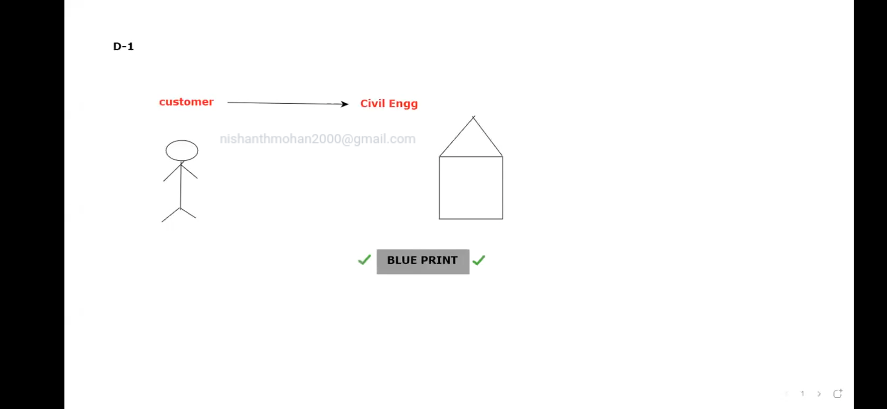

---
Diagram 2
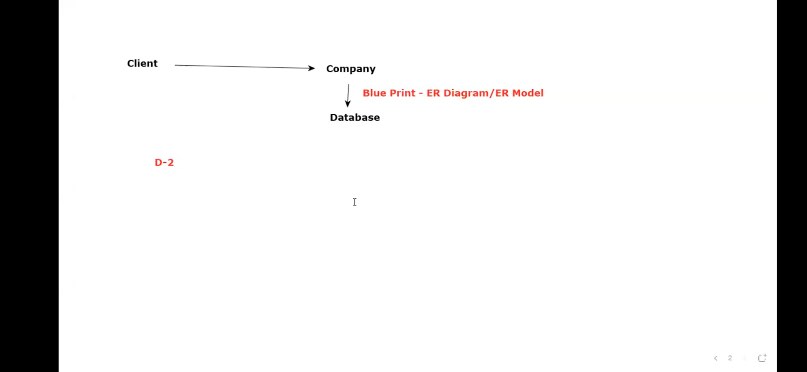
---
ex:
---
School --> S/W company
1. student data
2. teachers data
3. account data
4. attendance data
5.
Student data
---
Diagram 3
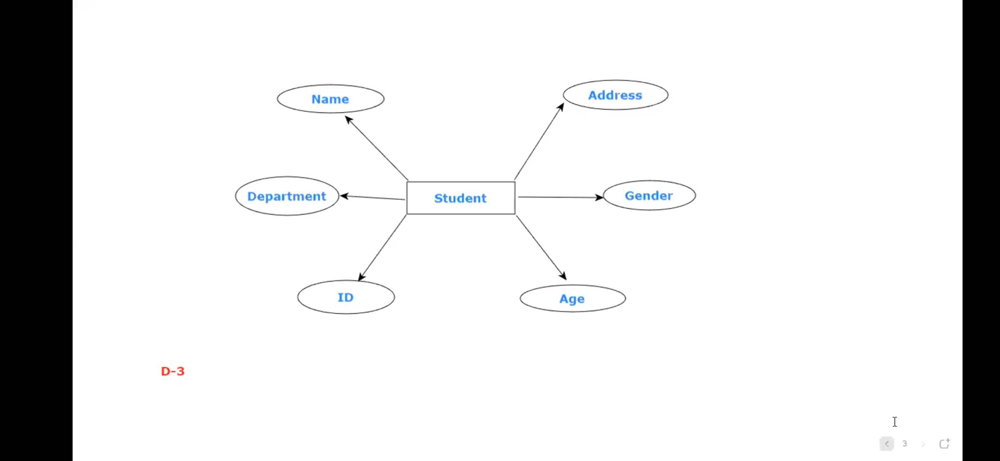

---
Components of ER Model:
---

Diagram 4 / Chart
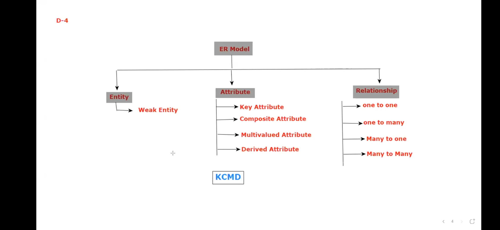

---
Entity:
-------
-   Its a living or non living real world things where the data would be maintained
-   Inorder to represent the entity in ER Model we have to use "Rectangle Box"

ex:
---
 Student, Employee, Bike, Car, Sandesh, Covid, Bangalore, Mysore

---
Diagram 5
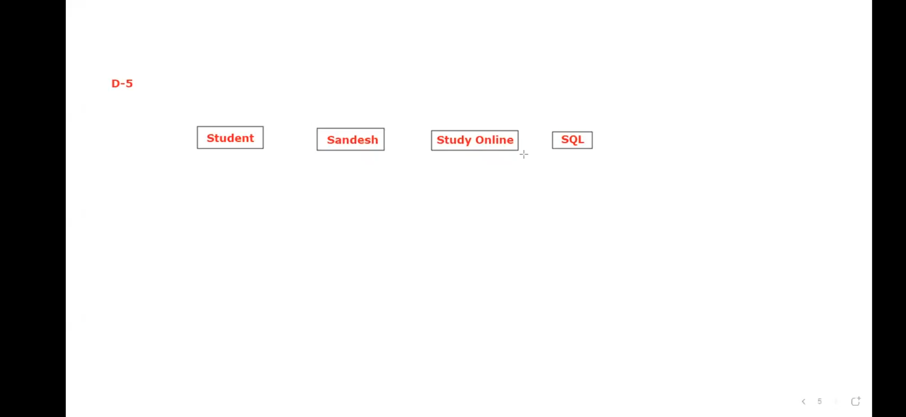
---

### 1. Weak Entity:
---

-   An entity which depends upon another entity is referred as Weak Entity
-   Inorder to represent the Weak Entity in ER Model we have to use "Double Rectangle Box"
-   Weak Entity does not contain any key attributes of its own

---
Diagram 6
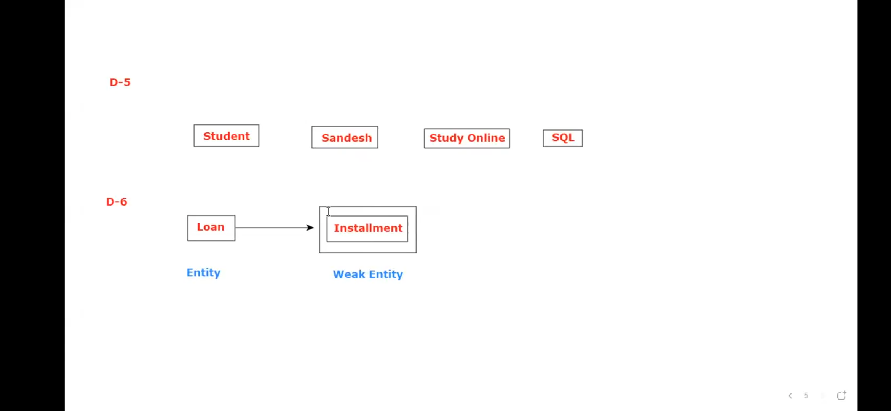
---

### Attributes:
---

-   Its a process of representing the properties or characteristics of an Entity
-   Inorder to represent the Attribute in ER Model we have to use "Oval/Ellipse"

---
ex1:
---
```
Color of Car
Price of Car
Name of Car
```

ex2:
---
```
 Name of Student
 Age of Student
```

---
Diagram 7

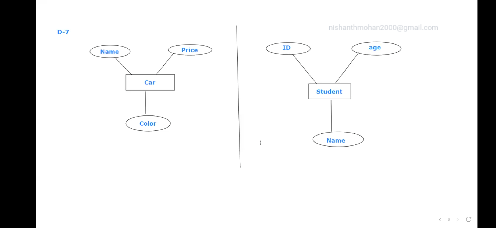

---
### Types of Attributes:
---

 There are 4 types of Attributes
1. Key Attribute
2. Composite Attribute
3. Multivaled Attribute
4. Derived Attribute

### 1.Key Attribute:
---
-   Key Attribute is an Attribute which represents the main characteristic of an Entity
-   Inorder to represent the Key Attribute in ER Model we have to use "Ellipse where text will be
underlined"
-   Key Attribute represents the Primary Key of an Entity

---
Diagram 8
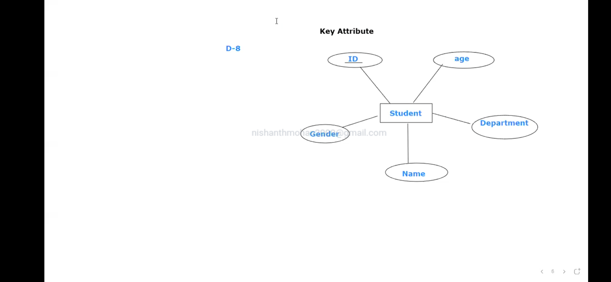
---
### 2. Composite Attribute:
---

-   Composite Attribute is an Attribute which represents the composed data of many other Attribute

-   Inorder to represent the Composite Attribute in ER Model we have to use "Ellipses where those
Ellipses are connected to one main Ellipse"

---

Diagram 9
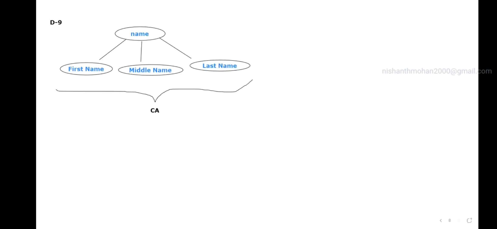
---
### 3. Multivaled Attribute:
---

-   Multivaled Attribute is an Attribute which has more than one value

-   Inorder to represent the Multivaled Attribute in ER Model we have to use "Double Ellipse"

---

Diagram 10
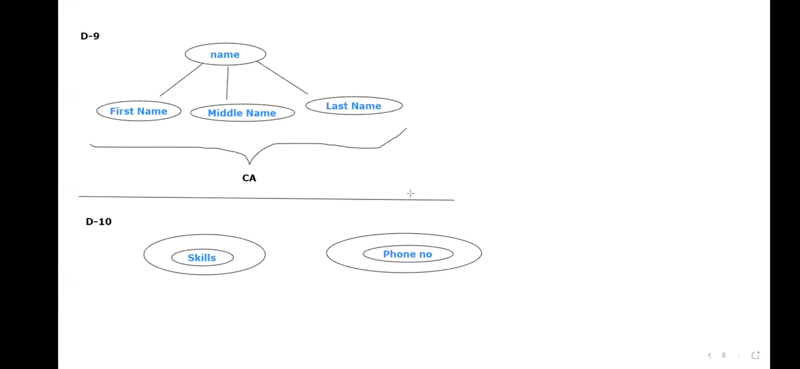
---
### 4. Derived Attribute:
---

-   Derived Attribute is an Attribute which got derived from other Attribute
-   Inorder to represent the Derived Attribute in ER Model we have to use "Dashed/dotted Ellipse"

---
Diagram 11
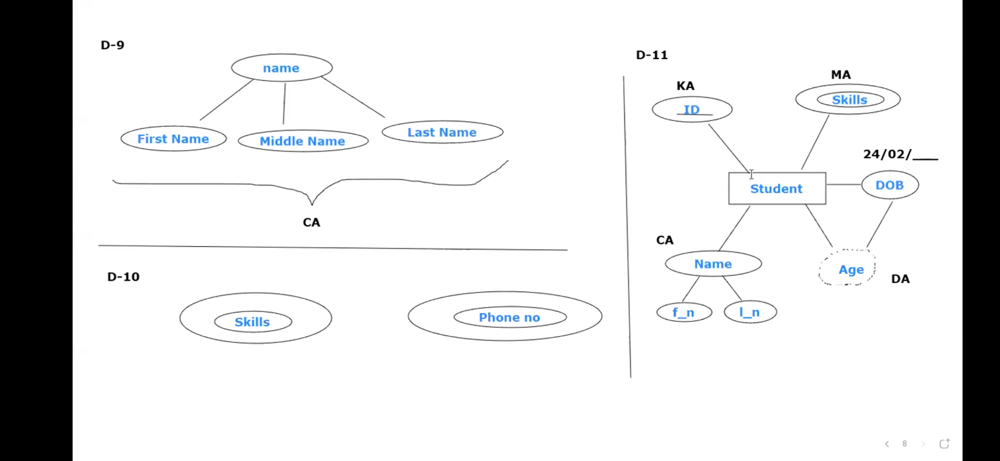
---
### Relationship:
---

-   Its a process of Describing the relation b/w entities
-   Inorder to represent the Relationship in ER Model we have to use "Rhombus"

---

Diagram 12
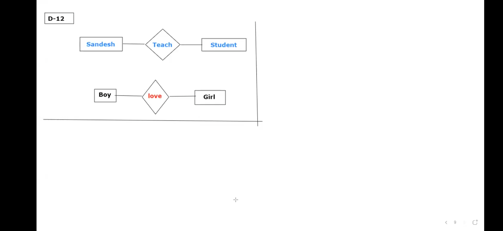
---

### Types of Relationship:
---
 There are 4 types of Relationship
1. 1 to 1 Relationship
2. 1 to many Relationship
3. many to 1 Relationship
4. many to many Relationship

---
### 1. 1 to 1 Relationship:
---
-   when only one instance of an entity is associated with another entity then it is referred as
1 to 1 Relationship
Diagram 13
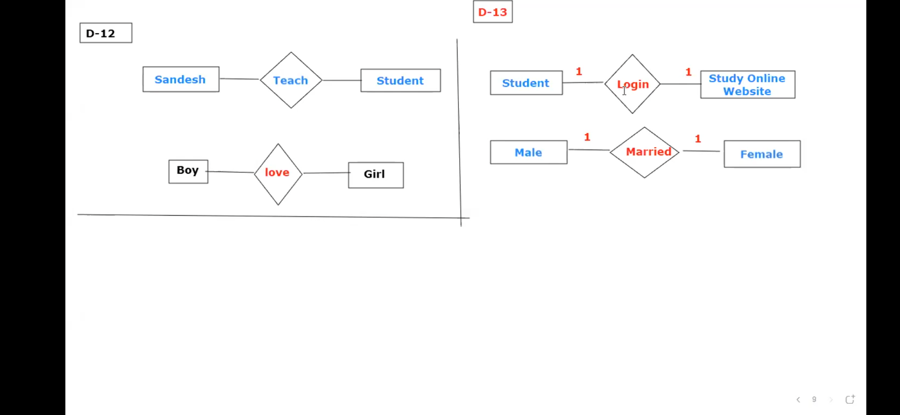

---
### 2. 1 to many Relationship:
---
-   when only one instance of an entity on the left side is associated with many entity on the right side
then it is referred as 1 to many Relationship
Diagram 14
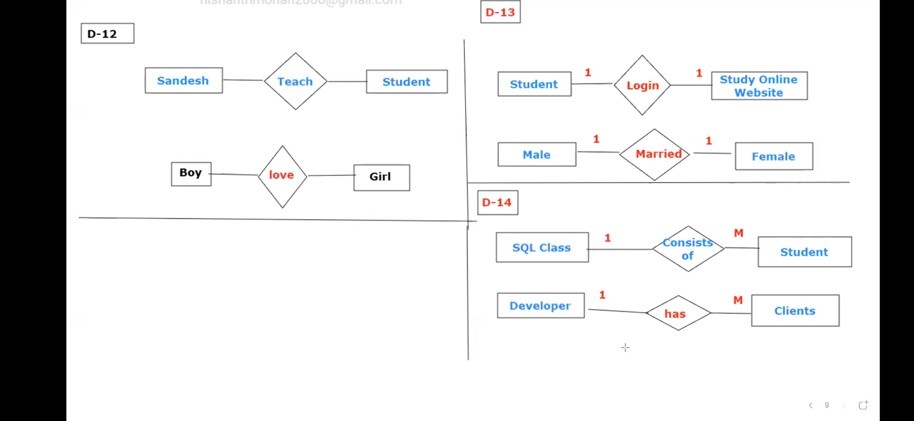
---
### 3. many to 1 Relationship:
---
-   when many entity on the left side is associated with only one entity on the right side then it is referred
as many to 1 Relationship
Diagram 15
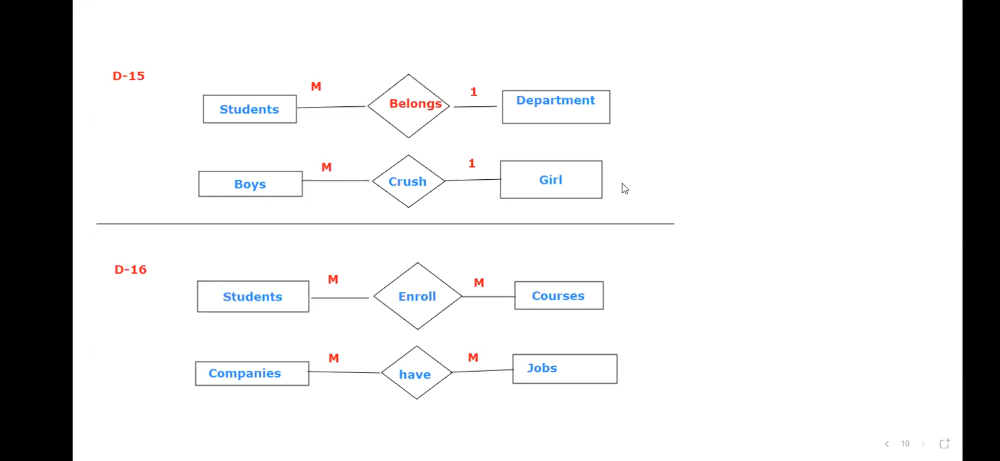
---
### 4. many to many Relationship:
---
-   when many entity on the left side is associated with many entity on the right side then it is referred as
many to many Relationship

Diagram 16

---
