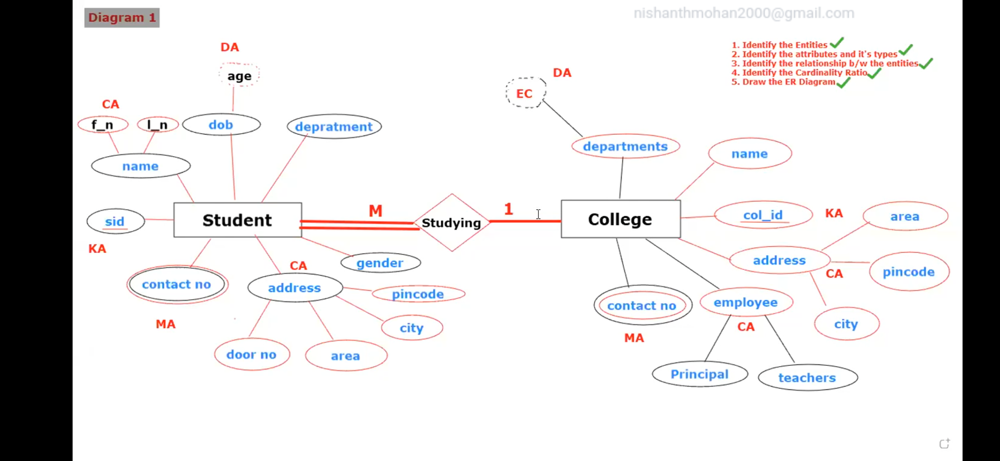
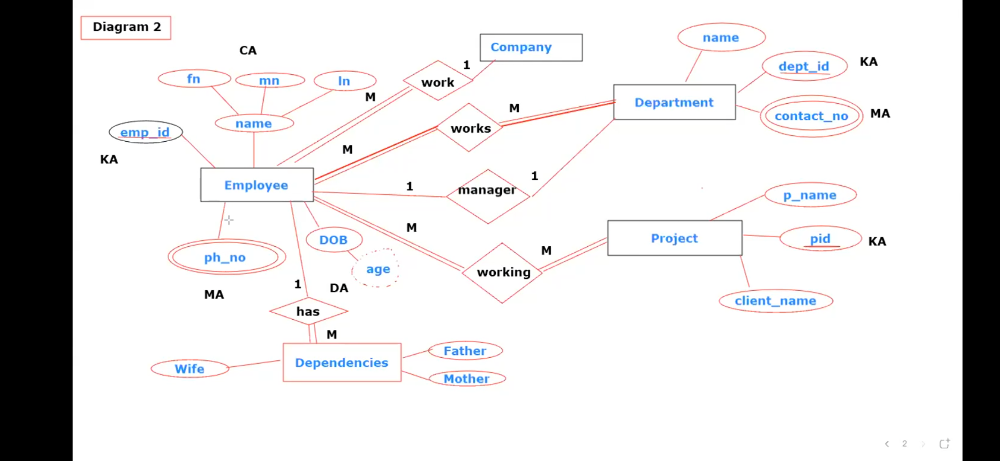

### Cardinality Ratio:
---
-   Its a Process of expressing the relationship
 or
-   The number of participants participating in a Relationship is
reffered as Cardinality Ratio

### Types of Cardinality Ratio:
---
1. 1 to 1
2. 1 to M
3. M to 1
4. M to M

Steps of write ER Diagram / ER Model:
---
 1. Identify the Entities
 2. Identify the attributes and it's types
 3. Identify the relationship b/w the entities
 4. Identify the Cardinality Ratio
 5. Draw the ER Diagram

---

1.  Write the ER Diagram for College database by keeping Student and College
as two entities

Diagram 1

---

2.  Write the ER Diagram for Company database by keeping by assuming the
entities

Diagram 2

---

### Homework

1.  Write the ER Diagram for Hospital database by keeping by
Hospital,Doctor,Patient and Rooms as an Entity

2.  Write the ER Diagram for Library Management database by assuming the
entities

3.  Write the ER Diagram for Movie database by assuming the entities
Write the ER Diagram for Restaurant Management System database by
assuming the entities